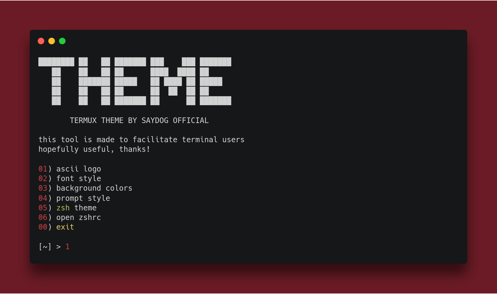

<H1 align="center">
TERMUX THEME
</H1>
<H4 align="center">
Tool for customize your terminal with ZSH
</H4>
<p align="center">
<a href="https://github.com/saydog"></a>
<a href="https://github.com/saydog"></a>
</br>
<a href="https://github.com/saydog"></a>
<a href="https://youtube.com/saydog-official"></a>
<a href="https://instagram.com/saydog.official"></a>
</p>
<p align="center">
Coded by <a href="https://instagram.com/iqbalmh18">Iqbalmh18</a>
  <a><br> Termux Theme version 1.2 </br></a>
  
</p>

## Features

| Name                               | Status             | Information                                        |
| ---------------------------------- | ------------------ | -------------------------------------------------- |
| Ascii logo                         | :white_check_mark: | Ascii logo generator                               |
| Font style                         | :white_check_mark: | Custom terminal fonts                              |
| Background colors                  | :white_check_mark: | Custom terminal colors                             |
| Prompt style                       | :white_check_mark: | Custom terminal prompt                             |
| Zsh theme                          | :white_check_mark: | Custom your zsh theme                              |

## Installation
Termux :
````
$ pkg install -y git python nano
$ git clone https://github.com/saydog/termux-theme
$ cd termux-theme
$ chmod +x install.sh
$ ./install.sh
````

## Usage
Run :

    $ python theme.py

## Disclaimer

This is an open source for everyone, you may redistribute, modify, use patents and use privately without any obligation to redistribute. but it should be noted to include the source code of the library that was modified (not the source code of the entire program), include the license, include the original copyright of the author (iqbalmh18), and include any changes made (if modified). Users do not have the right to sue the creator when there is damage to the software or even demand if there is a problem caused by the makers of this tool. because every risk is caused by the user risk it self.
Hatur nuhun 😊

